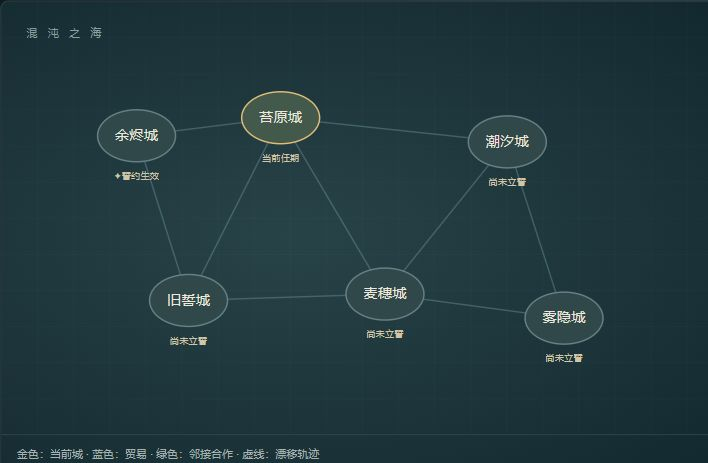

# 大陆漂移假说

**The Continental Drift Hypothesis** · 城市漂移、誓约火炬与六十轮世界演化的游戏概念原型。

作为造物主的使者，你在每座城市只能停留六轮。城市各自漂移，距离改变贸易、合作与摩擦；你可以留下一个誓约，守护城中某项事物。第六十轮，世界根据留下的历史迎来结局。



> 当前版本：v0.2.0。默认使用明确标注的本地模拟。真实 AI 接口已预留，尚未使用模型供应商凭据完成联调。

## 快速运行

[在线试玩（本地模拟）](https://continental-drift-mingdizhiying.mingdizhiying.chatgpt.site)：无需登录或配置密钥，打开网页即可游玩。刷新会重新开始，请先导出需要保留的历史。

需要 **Node.js 24 LTS 或以上**。项目没有第三方 npm 依赖，无须安装依赖即可启动。

```sh
 git clone https://github.com/mingdizhiying/continental-drift-hypothesis.git
 cd continental-drift-hypothesis
 npm start
```

浏览器打开 [http://127.0.0.1:4173](http://127.0.0.1:4173)。本地服务器必须保持运行；该地址仅用于运行服务器的设备，不是在线部署地址。私有仓库克隆需要对应的 GitHub 访问权限。

```sh
npm test
npm run check
```

## 玩法

- **独立漂移**：六座城市按各自轨迹移动，地图展示当前位置、起点位移与城市连接。点击城市可查看状态。
- **城市治理**：耕种、建设、林地修复、倾听调解、采集、修复屏障、公开秘密或观察，每次行动推进一轮。
- **誓约火炬**：输入誓言，查看实行条件并确认。每城保留一条，立誓和替换不推进时间，离任后继续保留。
- **六轮任期**：第6、12、18……54轮结束后，自动前往最近的其他城市，允许返回旧城。
- **世界回响**：城市距离影响合作、贸易与摩擦，每轮还会发生一个当前城市的市民事件。
- **历史结算**：第60轮结束游戏，根据世界状态和操作历史生成结局。可以导出完整JSON记录。

“本轮世界回响”位于页面顶部，城市操作与誓约位于中部，地图位于底部。

## 誓约能力

本地模拟支持以下五种守护能力与三种旧城法则。条件按本轮开始的状态判断；不足时暂时休眠，满足后恢复。指标保护以轮初值扣除主动支付成本为底线，仍可增长。

| 固定事物 | 本地实行条件 | 每轮维护代价 |
| --- | --- | --- |
| 城市位置 | 安定 ≥35 | 繁荣 −1 |
| 粮食储备 | 繁荣 ≥30 | 繁荣 −1 |
| 社会安定 | 粮食 ≥25 | 粮食 −1 |
| 贸易繁荣 | 安定 ≥40 | 生态 −1 |
| 生态 | 粮食 ≥30 | 繁荣 −1 |

示例：`愿此城永不缺粮`、`城市位置不变`、`守护森林`。本地规则不具备通用自然语言理解能力，多目标或无法识别的文本会被拒绝。

## 统一城市治理与圣光屏障

城市治理与屏障建设合并为一个行动面板，只使用粮食、安定、繁荣、生态四项0–100资源。繁荣同时承担原物资的建设调配作用，安定承担原信任作用，不再保留独立物资与信任。初始四项资源沿用六城配置，屏障初始0/6。返回旧城保留全部进度。

| 行动 | 先支付 | 获得 |
| --- | --- | --- |
| 组织耕种 | 繁荣2、生态3 | 粮食10 |
| 建设集市 | 粮食4、生态4 | 繁荣9 |
| 修复林地 | 粮食3、繁荣5 | 生态10 |
| 倾听与调解（合并调查和调解） | 粮食3、繁荣2 | 安定7 |
| 采集灵木 | 生态10、安定4 | 繁荣12 |
| 修复圣光屏障 | 繁荣18、粮食7、生态4、安定3 | 屏障2 |
| 公开秘密，取回光核 | 安定16、繁荣4 | 屏障2，每城一次 |
| 观察世界 | 无直接支付 | 无直接收益，仍推进一轮 |

每个有效行动之后，各城粮食基础消耗由1提高至2；合作与贸易带来的繁荣收益每城每轮合计最多2（市民事件和玩家行动收益另计）。邻接合作仍可补充粮食，市民事件与誓约维护仍然结算。先检查全部成本，资源不足或屏障完成后重复修复不会推进时间，按钮显示不足原因。

禁火、禁谎、偿债仍与其他守护共用每城唯一誓约，安定≥35生效，无额外每轮维护消耗：禁火采集支付4生态、获得9繁荣且不减安定，修复不消耗生态但只得1屏障；禁谎调查获得11安定，公开秘密支付24安定；偿债修复支付24繁荣、9粮食、4生态、5安定，获得3屏障。其他行动按表执行。

誓约保护本轮初始资源扣除主动支付后的余额，不返还建设、采集或公开秘密的成本；保护条件仍按轮初判断。由此避免守护繁荣后免费修复屏障。模拟AI附加影响使用同一保护边界，尚未进行真实模型联调。

每六轮离任前记录结果：屏障<6为长夜；屏障6且安定≥60、粮食≥20为共誓；否则为孤光。第60轮汇总十次任期及全部六城。屏障完成后地图显示金色光环，不固定城市、不额外保护指标。十种市民事件的条件说明仍在页面最底部，城市漂移仍为初版4倍。

初始余烬城的一条可行路线：立偿债誓约 → 修复 → 采集 → 耕种 → 倾听与调解 → 修复 → 倾听与调解，可在六轮达成共誓。将耕种拖到最后会触发粮仓告急，使同样的行动组合落入孤光；先后顺序、资源底线与建设速度需要一起考虑。此路线仅针对初始城状态，其他城市需重新评估。

## 接入真实 AI

公开试玩版本固定使用本地模拟，不展示真实AI开关，也不提供模型代理。以下配置仅适用于本地开发服务器。

服务器通过 `POST /api/world` 提供三类任务：

| 任务 | 用途 |
| --- | --- |
| oath | 判断誓约能否实行，并映射到已实现的保护能力 |
| turn | 根据城市距离与历史提出额外城市影响 |
| ending | 读取完整世界历史，生成带轮次证据的结局 |

接口要求模型服务兼容 Chat Completions 的 `messages` 请求和 `choices[0].message.content` 响应。模型必须返回约定的 JSON；城市额外影响限制为每城一次、每指标±3，且不能突破生效中的誓约。

复制 `.env.example` 为 `.env`，填写完整接口地址、模型名称和密钥，然后运行：

```sh
node --env-file=.env server.js
```

普通 `npm start` **不会自动读取 `.env`**。也可以先在终端设置环境变量，再启动服务器：

```powershell
$env:LLM_ENDPOINT = 'https://your-provider.example/v1/chat/completions'
$env:LLM_MODEL = 'your-model-name'
$env:LLM_API_KEY = 'your-api-key'
npm start
```

启动后勾选页面的“使用真实 AI 接口”。密钥只保存在服务器环境中。未配置、超时或响应格式错误时，界面会说明原因并回退本地模拟；AI明确拒绝的誓约不会自动改为接受。

## 结构与验证

| 文件 | 职责 |
| --- | --- |
| index.html / style.css | 页面结构和样式 |
| app.js | 地图、交互、事件与历史显示 |
| barrier.js | 城内选择、旧法则与圣光屏障结果 |
| world.js | 漂移、誓约、城市互动、迁城与结算 |
| server.js | 本地静态服务与模型代理 |
| world.test.js | 24项规则测试 |
| 策划案.md | 世界观与详细规则 |

测试覆盖轮次、独立漂移、誓约约束、最近城市迁移、六十轮结算、历史记录与AI影响边界。GitHub Actions在推送和PR时执行语法检查和规则测试。

## 当前限制

- 真实模型效果和兼容性仍需供应商凭据联调。
- 刷新或重新创造世界会清空当前进度；尚未实现存档恢复。
- 地图是玩法模拟，暂未实现信息迷雾、程序化地形或代码热更新。
- 本地事件与判定是固定规则；数值平衡仍需真人试玩。
- 原型采用AI辅助开发，功能与验证范围以仓库代码、测试和版本记录为准。

## 版本与协作

### 发布在线试玩版

```sh
npm run build:demo
```

该命令将6个可公开的游戏文件写入 `dist/`，关闭在线版的真实AI入口，保留本地开发界面。部署仅发布 `dist/` 的内容，不上传服务器、环境变量或个人历史。所有玩家独立运行各自的世界，刷新会重新开始。

Sites发布身份与静态目录记录在 `.openai/hosting.json`；后续更新复用同一站点。GitHub是日常源码与PR的版本管理来源，Sites保存用于部署的源代码快照。发布前运行测试、重新导出并检查 `dist/` 与源码一致。

当前与后续开发统一在本仓库保留版本。稳定基线位于main，功能开发使用分支和PR，发布以版本标签记录。

- [更新记录](CHANGELOG.md)
- [开发与贡献](CONTRIBUTING.md)
- [项目协作约定](AGENTS.md)
- [策划案](策划案.md)

本仓库暂未指定开源许可证。
